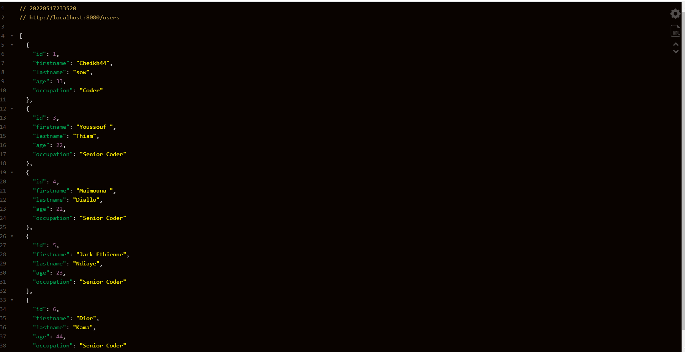

<pre>
Codé par Epsilon
            .-"''-.  _
          .'       `( \ 
        @/            ')   ,--,__,-"
        /        /      \ /     /   _/
      __|           ,   |/         /
    .~  `\   / \ ,  |   /
  .~      `\    `  /  _/   _/
.~          `\  ~~`__/    /
~             `--'/
             /   /    /
            /  /'    /EpsilonCoder
</pre>
## Demonstration

